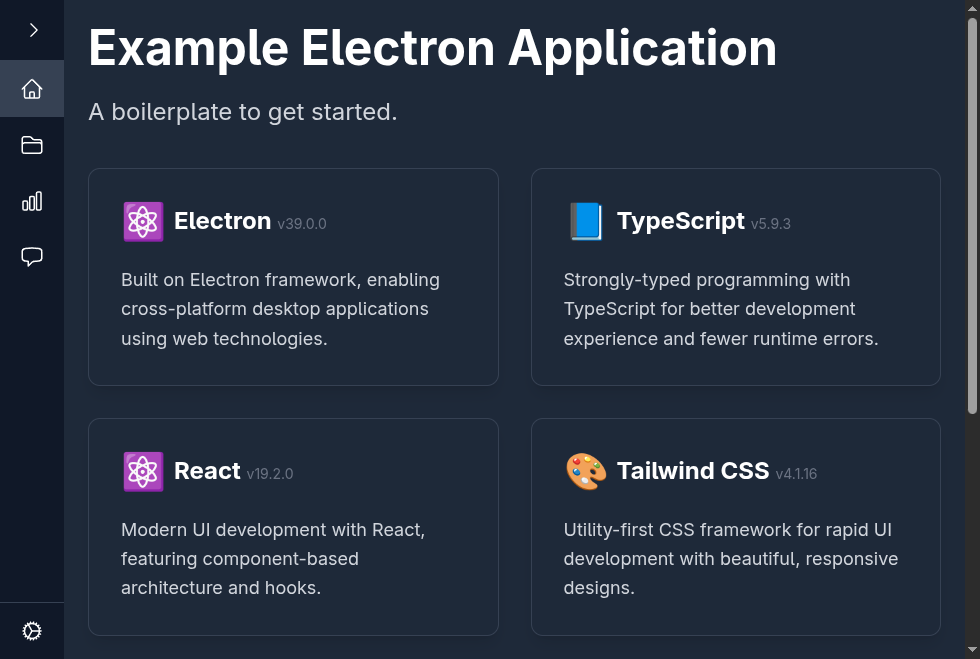

# Example Electron Application

An example to showcase a typescript-based electron application.

Uses native esm everywhere possible (`main` and `renderer`), as electron 28 now supports it. `preload` bundle is still commonjs to allow sandbox.

Showcases creation of a direct communication channel between the renderer and main. Revives itself upon window reload.

## Scripts

`npm run build` - bundles `src` into `dist` in **production** mode. No source-maps.

`npm run build:watch` - bundles `src` into `dist` in **development** mode and watches. Source-maps are generated.

`npm start` - runs `dist` using electron. If `dist` was built in development mode, `main` is debuggable using VSCode's JavaScript Debug Terminal.

`npm run build:unpacked` - builds `dist` into `out/<arch>-unpacked` containing a self contained electron application.

`npm run build:packed` - same as `npm run unpacked`, but also builds `deb`, `rpm`, `snap`, and `zip` packages into `out`.

`npm run build:full` - runs `npm run build` and `npm run build:packed`.

`npm run typecheck` - checks sources using typescript.

## Screenshots

### Dark Theme



### Light Theme


## Prerequisites for `build:full`

On a freshly installed Fedora 41, with all updates:

To build `.deb`:
```sh
sudo dnf install dpkg fakeroot libxcrypt-compat
```

To build RPM:
```sh
sudo dnf install rpm-build rubygems
gem install fpm
```

## License

MIT
